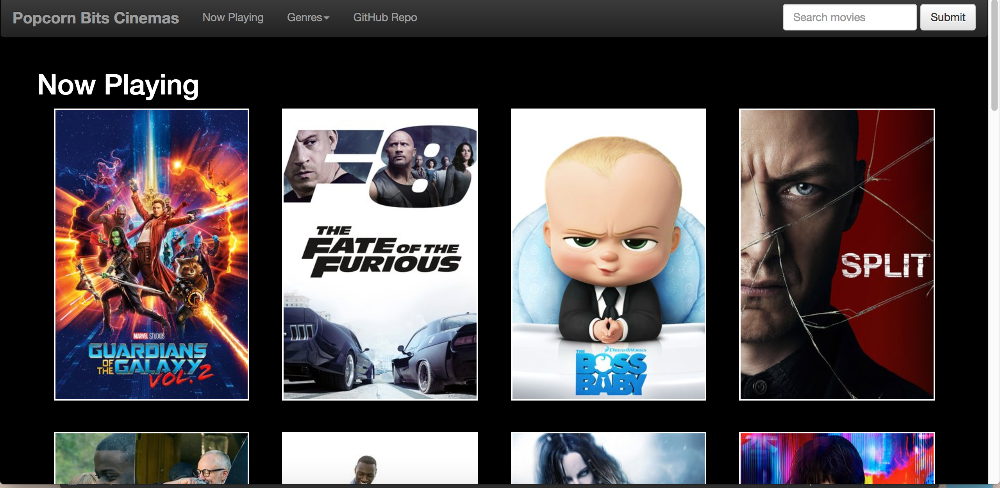
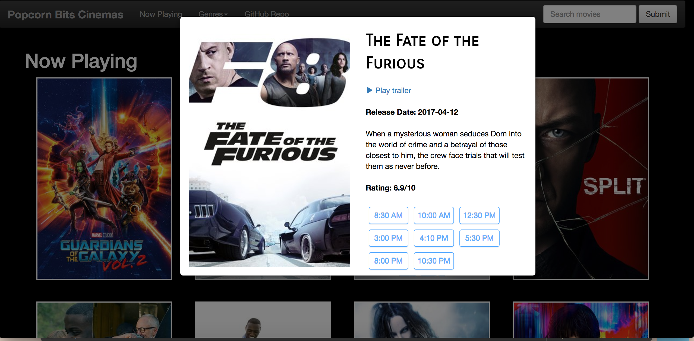

# Popcorn Bits Cinema

## Description/Overview
Popcorn Bits Cinema is a movie app made with HTML, CSS, Javascript, jQuery and Bootstrap. It pulls movies from The Movie Database using API calls. Users have the option to view the top playing movies, sort them by genre or search for other movies using the search function.

[Live URL](http://www.dangconnie.com/movie-app/)

[GitHub Repo](https://github.com/dangconnie/movie-app)

## Table of contents

[Description/Overview](#description/overview) // [GitHub Link](#github-link) // [Technologies Used](#technologies) // [Challenges and Solutions](#challenges-and-solutions) // [Code Snippets and Screenshots](#code-snippets-and-screenshots)


## Technologies
The following languages, frameworks and APIs were used:

  * HTML

  * CSS

  * Javascript

  * jQuery

  * Bootstrap
  
  * The Movie Database API 
  

## Challenges and Solutions
1.  **Challenge:** One of the challenges was making sure that the modal would display details on whichever movie was clicked on. Originally, the modal would only display the details for most recent movie (first movie from left to right) no matter which poster was clicked on. This was true without regard to whether the movies were sorted by genre or displaying the latest movies.

   	**Solution:** While building the HTML string, I had to include `i` in the modal portion of the new HTML string to target each clicked poster. 


2. **Challenge:** Despite having a correctly built HTML, the searched movie(s) did not show when the user clicked "Submit". 

  	**Solution:** Just running the `searchMovies` function when the form is submitted did not work because the `movieGrid` id already has an HTML attached to it. I couldn't overwrite it using `.html()`. As a result, I decided to run `searchMovies` with an empty query string before a search term is captured. When a user types in a search term, the function is ran again with the search term as an endpoint. This time, the new HTML string will overwrite the one created from the empty string search. 

  	```js
  	var searchTerm = '';
	searchMovies();
	//reference entire search form
	$('.searchForm').submit(function(event){
		$('#movie-grid').html('');
		event.preventDefault();
		//search term is only concerned with what the user inputted 
		//Get input with .val();
		searchTerm = $('.form-control').val();
		searchMovies();
	})

  	```

## Code Snippets and Screenshots

When visiting this URL, the user is greeted with a page of the latest movies that are now playing in theaters.



Clicking on each movie opens up its details in a modal. Within the modal, users can view the trailer or see the times that the movies are playing at Popcorn Bits. Overviews, release dates and ratings for the movie are also visible.



To get the data for each movie, I had to run `$.getJSON` twice, once for the results and the second time to get particular data for each of those results. Additionally, I used a "for" loop after the first one to target where the data from `movieSearchResults` is. To make it possible for the app to display movies categorized by genre and searched movies, I initiated an empty HTML string and then built a new HTML string to overwrite it (using `.append()``). To change the label on the page accordingly, I had it attached via `.html()` to the `movieGenreLabel` id from the `index.html` file. You can see `console.log()` throughout the code snippet, because I was testing my code at every point to make pinpointing bugs easier.

```js
	function searchMovies(){
		//need to include query in url. (ex: &query=boss+baby)
		const searchMovieURL = apiBaseURL + 'search/movie?api_key=' + apiKey + '&language=en-US&page=1&include_adult=false&query=' + searchTerm;
			// console.log(searchMovieURL);
		$.getJSON(searchMovieURL, function(movieSearchResults){
			// console.log(movieSearchResults);
			for (let i = 0; i<movieSearchResults.results.length; i++){
				var mid = movieSearchResults.results[i].id;
				var thisMovieUrl = apiBaseURL+'movie/'+mid+'/videos?api_key=' + apiKey;		

				$.getJSON(thisMovieUrl, function(movieKey){
					// console.log(movieKey)
					var poster = imageBaseUrl+'w300'+movieSearchResults.results[i].poster_path;
					var title = movieSearchResults.results[i].original_title;
					var releaseDate = movieSearchResults.results[i].release_date;
					var overview = movieSearchResults.results[i].overview;
					var voteAverage = movieSearchResults.results[i].vote_average;
					var youtubeKey = movieKey.results[0].key;
					var youtubeLink = 'https://www.youtube.com/watch?v='+youtubeKey;
					var searchResultsHTML = '';
					searchResultsHTML += '<div class="col-sm-3 col-md-3 col-lg-3 eachMovie">';
						searchResultsHTML += '<button type="button" class="btnModal" data-toggle="modal" data-target="#exampleModal'+ i + '" data-whatever="@' + i + '">'+'</button>'; 
						searchResultsHTML += '<div class="modal fade" id="exampleModal' + i +'" tabindex="-1" role="dialog" aria-labelledby="exampleModalLabel" aria-hidden="true">';
							searchResultsHTML += '<div class="modal-dialog" role="document">';
								searchResultsHTML += '<div class="modal-content col-sm-12 col-lg-12">';
									searchResultsHTML += '<div class="col-sm-6 moviePosterInModal">';
										searchResultsHTML += '<a href="'+youtubeLink+'"></a>'; 
									searchResultsHTML += '</div><br>';//close trailerLink
									searchResultsHTML += '<div class="col-sm-6 movieDetails">';
										searchResultsHTML += '<div class="movieName">'+title+'</div><br>';
										searchResultsHTML += '<div class="linkToTrailer"><a href="'+youtubeLink+'"><span class="glyphicon glyphicon-play"></span>&nbspPlay trailer</a>' + '</div><br>';	
										searchResultsHTML += '<div class="release">Release Date: '+releaseDate+'</div><br>';
										searchResultsHTML += '<div class="overview">' +overview+ '</div><br>';
										searchResultsHTML += '<div class="rating">Rating: '+voteAverage+ '/10</div><br>';
										searchResultsHTML += '<div class="col-sm-3 btn btn-primary">8:30 AM' + '</div>';
										searchResultsHTML += '<div class="col-sm-3 btn btn-primary">10:00 AM' + '</div>';
										searchResultsHTML += '<div class="col-sm-3 btn btn-primary">12:30 PM' + '</div>';
										searchResultsHTML += '<div class="col-sm-3 btn btn-primary">3:00 PM' + '</div>';
										searchResultsHTML += '<div class="col-sm-3 btn btn-primary">4:10 PM' + '</div>';
										searchResultsHTML += '<div class="col-sm-3 btn btn-primary">5:30 PM' + '</div>';
										searchResultsHTML += '<div class="col-sm-3 btn btn-primary">8:00 PM' + '</div>';
										searchResultsHTML += '<div class="col-sm-3 btn btn-primary">10:30 PM' + '</div>';
									searchResultsHTML += '</div>'; //close movieDetails
							searchResultsHTML += '</div>'; //close modal-dialog
						searchResultsHTML += '</div>'; //close modal
					searchResultsHTML += '</div>'; //close off each div
					// console.log(searchResultsHTML)
					$('#movie-grid').append(searchResultsHTML);
					//Label will be whatever user input was
					$('#movieGenreLabel').html(searchTerm);	
				})
			}
		})
	}

```